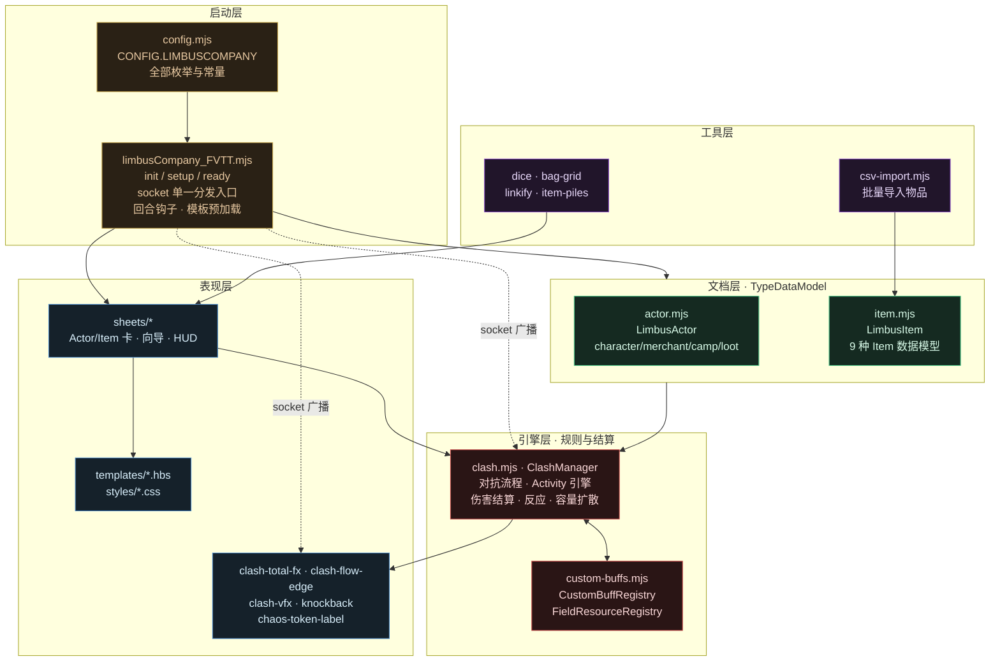
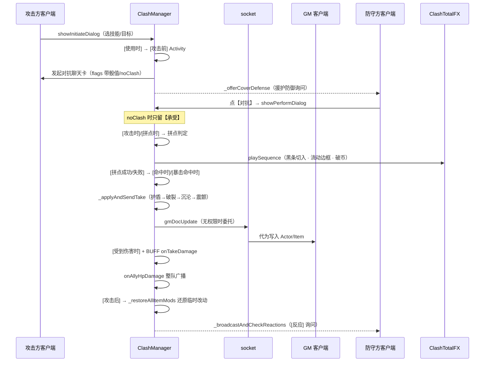

# 边狱巴士都市规则 · FVTT 系统开发总览

**Foundry VTT v13+ 自定义游戏系统**
系统 ID：`limbusCompany_FVTT` | 当前版本：`1.0.0` | 更新：2026-09-03

> 本文件是项目现状的索引与总览：**现在有什么、在哪里、谁调谁**。
> 规则细节以 `策划文件/` 为准，代码模式与开发流程见 `CLAUDE.md`。
> 规则原文见 `策划文件/规则书.md`（面向玩家的完整规则）。
> 规模参考：`module/` 下 37 个 `.mjs`，约 32,300 行；`templates/` 26 个 `.hbs`。

---

## 目录

1. [架构图](#一架构图)
2. [目录结构](#二目录结构)
3. [分层职责](#三分层职责)
4. [关键数据流](#四关键数据流)
5. [策划文件索引](#五策划文件索引)
6. [素材资源索引](#六素材资源索引)
7. [核心数据模型速查](#七核心数据模型速查)
8. [扩展点：往系统里加东西](#八扩展点往系统里加东西)
9. [技术关键点清单](#九技术关键点清单)
10. [已知空白与后续方向](#十已知空白与后续方向)

---

## 一、架构图

### 1.1 分层总览



**依赖方向**：启动层 → 文档层 → 引擎层 → 表现层，工具层横切。
引擎层**不反向依赖** Sheet（唯一例外：丢弃消耗要读战斗袋状态，走 `owner.sheet._discardCombatSkill`）。

### 1.2 一次对抗的完整链路



### 1.3 Activity 效果管线

一切物品效果都走同一条管线（`ClashManager._applyActivities`）：


- **前置全部满足**才继续；多个「每」取**最小**倍数
- **消耗先整体预检查**，付不起则整条跳过（丢弃按顺序模拟、随机消耗要求至少一条付得起）
- 倍数放大效果的层数 / 强度 / 数值 / 震颤引爆次数

---

## 二、目录结构

```
limbusCompany_FVTT/
├── system.json                  ← 系统清单：4 Actor + 9 Item 类型注册、版本 1.0.0
├── template.json                ← 遗留兼容占位（真实 schema 在 module/documents/）
├── 开发总览.md                  ← 本文件
├── CLAUDE.md                    ← 代码模式与开发流程
├── lang/zh-CN.json
├── 策划文件/                    ← 规则裁决依据（第五节）
├── assets/{icons,audio,logo}/   ← 图标 / 音效 / LOGO（第六节）
├── styles/limbusCompany_FVTT.css
├── templates/                   ← 24 个 .hbs
│   ├── actor/{character,merchant,camp,loot}-sheet.hbs + parts/{header,tab-items,tab-skills,tab-combat}
│   ├── item/{equipment,skill,consumable,container,skillbook,recipebook,panic,background}-sheet.hbs
│   ├── apps/{background-wizard,level-up-dialog,csv-import}.hbs
│   ├── partials/{title-card,activity-editor}.hbs
│   └── {gm-console,squad-hud,quick-action-hud,sin-resource-hud}.hbs
└── module/                    ← 37 个 .mjs
    ├── limbusCompany_FVTT.mjs   1459 行  系统入口
    ├── config.mjs                451 行  全局常量
    ├── documents/
    │   ├── actor.mjs            1699 行
    │   └── item.mjs              997 行  含 activeVariantPrefix（当前生效哪一套数值）
    ├── sheets/
    │   ├── item-sheet.mjs       4239 行  9 种物品共用，含 Activity 编辑器
    │   ├── actor-sheet.mjs      2790 行  角色卡（三 Tab）
    │   ├── camp-sheet.mjs       1740 行  营地（仓库 + 制作 + 配方表）
    │   ├── quick-action-hud.mjs 1094 行
    │   ├── loot-sheet.mjs       1054 行
    │   ├── merchant-sheet.mjs    942 行  含打折 / 打烊
    │   ├── background-wizard.mjs 420 行  4 步创建向导
    │   ├── squad-hud.mjs         288 行
    │   ├── gm-console.mjs        285 行  按文件夹分组选角色
    │   ├── csv-import-dialog.mjs 238 行
    │   └── level-up-dialog.mjs   138 行  三步：数值 → 训练等级强化 → 奖励物品
    └── helpers/
        ├── clash.mjs           7531 行  对抗引擎（全仓最大）
        ├── custom-buffs.mjs    1373 行  BUFF / 场地资源注册表
        ├── csv-import.mjs      1064 行  CSV 解析、列映射、同名卡合并
        ├── clash-total-fx.mjs   742 行  TOTAL 黑条演出
        ├── token-ring-hud.mjs   459 行  Token 下的生命环 / 理智圆 / BUFF 行
        ├── sin-resource-hud.mjs 421 行  全局罪孽池
        ├── grid-dnd.mjs         357 行  网格拖放（背包/仓库/战利品共用）
        ├── ready-sparkle.mjs    323 行  就绪闪光
        ├── knockback.mjs        291 行  击退 / 瞬移
        ├── clash-vfx.mjs        281 行  爆点 / 飘字
        ├── clash-flow-edge.mjs  270 行  黑条流动边框（canvas 流体）
        ├── grid-layout.mjs      183 行  网格摆放与自动寻位
        ├── dice.mjs             179 行  属性鉴定
        ├── recipe-editor.mjs    143 行  配方编辑（营地与配方表共用）
        ├── container-rules.mjs  138 行  容器存放限制与嵌套判定
        ├── chaos-token-label.mjs 119 行  Token 上的混乱标签
        ├── window-header.mjs    108 行  标题栏收纳（⋮ 菜单）
        ├── bag-grid.mjs         106 行  背包网格打包
        ├── proximity.mjs         91 行  距离/邻接判定
        ├── turn-banner.mjs       87 行  回合开始横幅（含 turn.wav）
        ├── item-piles.mjs        86 行  Item Piles 联动
        └── linkify.mjs           80 行  文本内 @UUID 链接化
```

---

## 三、分层职责

### 启动层

**`limbusCompany_FVTT.mjs`** —— 系统唯一入口，`system.json` 的 `esmodules` 只列它。

| 钩子 | 做什么 |
|---|---|
| `init` | 挂 `CONFIG.LIMBUSCOMPANY`；注册文档类 / 数据模型 / Sheet；**注册唯一的 `game.socket.on`**；先攻公式；快捷键（`M` GM控制台 / `Z`·`X` 小队HUD）；`_registerSettings()`；`_preloadTemplates()` |
| `setup` | 本地化常量 |
| `ready` | 创建 HUD 单例；三项**载入时数据修复**：`_clampBuffStacks()`（BUFF 上限校正）、`_restoreItemTempMods()`（残留的临时骰面改动还原）、`_normalizeItemTags()`（标签字符串→数组） |
| `updateCombat` | 回合结束/开始的 BUFF 清理与晋升、`[回合结束时]`/`[回合开始时]` Activity、BUFF 的 `onRoundEnd`/`onRoundStart` |

**socket 是单通道多路分发**——只有一个 `game.socket.on("system.limbusCompany_FVTT")`，依次喂给 7 个消费者：

```
SinResourceHUD → ClashManager → ClashTotalFX → ClashVFX
              → LimbusMerchantSheet → LimbusCampSheet → LimbusLootSheet
```

> 新增跨客户端流程时**加一个 case，不要再注册第二个 `game.socket.on`**。

**`config.mjs`** —— 全部枚举挂在 `CONFIG.LIMBUSCOMPANY` 上，运行时随处可读：七宗罪、物理伤害类型、BUFF 目录与说明、混乱等级（`CHAOS_TYPES`/`CHAOS_NAMES`）、回合结束清除名单、EGO 等级与星芒消耗、升级 XP 表、Activity 的 17 种触发时机、骰子类型。

### 文档层

| 文件 | 内容 |
|---|---|
| `documents/actor.mjs` | `LimbusActor`（长休、升级、混乱阈值、BUFF 增删、恐慌/混乱 Activity 派发）+ `CharacterData`/`MerchantData`/`CampData`/`LootData` |
| `documents/item.mjs` | `LimbusItem`（骰子公式、星芒消耗、Activity 增删、`sendToChat`、`activeVariantPrefix`）+ 9 种 `TypeDataModel` |

字段全部在 `defineSchema()` 里，`template.json` 是空壳。

### 引擎层

**`clash.mjs` · `ClashManager`（7531 行，静态类）** —— 系统的心脏：

| 模块 | 职责 |
|---|---|
| 对抗流程 | `showInitiateDialog` → `showPerformDialog` → 拼点判定 → 承受；含单方面攻击、援护防御、不可摧毁反击 |
| Activity 引擎 | `_applyActivities`：17 触发时机 × 前置/消耗/效果三段 |
| 伤害结算 | `_applyAndSendTake`：护盾 → 破裂 → 沉沦 → 震颤 → 混乱阈值 |
| 反应系统 | `_checkAndOfferReactions`：只扫装备格里的装备 + 全部技能 |
| 容量扩散 | `handleWeightTake`：链式扩散 / 广域乱射的自动连击 |
| 跨权限写入 | `_safeDocUpdate`：无权限则 socket 委托 GM |
| 临时改动还原 | `TEMP_MOD_PATHS` + `_stashItemMod`/`_restoreAllItemMods`：骰数/面数/基础值/容量/骰型只在本次攻击内有效 |

**`custom-buffs.mjs`** —— 两个注册表：

- `CustomBuffRegistry`：BUFF 注册表。声明式字段 `maxStacks` / `maxIntensity` / `maxGainPerRound` / `refreshOnGain` / `keepAtZero` / `specialTremor`，加 **18 个可选钩子**：

  | 分类 | 钩子 |
  |---|---|
  | 回合 | `onRoundStart` `onRoundEnd` `onStatusTick` |
  | 对抗 | `onClashWin` `onClashLose` `modifyDiceRoll` `modifySpeedRoll` |
  | 伤害 | `modifyIncomingDamage` `modifyOutgoingDamage` `onTakeDamage` `onAllyHpDamage` |
  | 其他 | `onHit` `onBuffGained` `onBuffLost` `beforeChaos` `modifyResistances` `onSeismicBlast` `onConsumed` |

- `FieldResourceRegistry`：全场共享的"场地资源"（如【血宴】）

### 表现层

Sheet 一览见 [第七节](#七核心数据模型速查) 前的表；演出层四件套：

| 文件 | 职责 |
|---|---|
| `clash-total-fx.mjs` | TOTAL 黑条：切入/退场、数字滚动、分段揭示、破币、容量扩散的常驻黑条、全场音效广播 |
| `clash-flow-edge.mjs` | 黑条内侧长边的**流动边框**：canvas 逐帧算双股流体，破币时提速+收细 |
| `clash-vfx.mjs` | 屏幕层爆点与 `+N` 飘字 |
| `knockback.mjs` | 击退与 `approach` 瞬移（`teleport:true` 保证所有客户端都是瞬移） |

### 工具层

`csv-import.mjs`（+ `csv-import-dialog.mjs`）批量导入物品；`dice.mjs` 属性鉴定；`bag-grid.mjs` 背包网格打包（角色卡与营地共用）；`linkify.mjs` 文本 UUID 链接化；`item-piles.mjs` 模组联动。

---

## 四、关键数据流

### 4.1 跨客户端写入（贯穿全系统）

```
任意客户端想改一个自己没权限的文档
        ↓
ClashManager._safeDocUpdate(doc, data, options)
        ↓ canUserModify? ── 是 ──→ doc.update()
        ↓ 否
socket "gmDocUpdate" ──→ GM 客户端代为执行
```

Sheet 层（商人/营地/战利品）也各有自己的 socket 消息类型，同样在那个单一监听器里分发。

### 4.2 演出的多端同步

演出方法先 `_emit()` 广播再本地播放，各客户端收到后各演一遍；`_enqueue` 保证同端多段演出排队不打架。

### 4.3 载入时数据修复

`ready` 钩子里跑三个自愈流程，用来收拾历史数据：BUFF 超上限截断、临时骰面改动残留还原、标签字符串拆回数组。**新增声明式约束时，记得同时补一条载入校正**——这是本项目的既定规矩。

---

## 五、策划文件索引

> 规则疑问一律先查这里，代码是这些文档的落地实现。

| 文件 | 内容 |
|------|------|
| `策划文件/规则书.md` | **面向玩家的完整规则书**：世界观、建卡、探索/营地、战斗、BUFF 一览 |
| `策划文件/大纲.txt` | 系统整体规则大纲（开发向，字段级口径以它为准） |
| `策划文件/角色卡设计.txt` / `角色卡设计文档.md` / `详细角色卡设计.txt` | 角色卡规格：颜色、布局尺寸、三大 Tab 完整规格 |
| `策划文件/对抗.md` | 对抗完整流程：发起→聊天框→拼点→承受，含全部 UI 弹窗规格 |
| `策划文件/物品卡设计.md` | 物品卡通用设计概述 |
| `策划文件/物品卡-装备.md` | 装备卡规格，含效果触发编辑器字段 |
| `策划文件/物品卡-技能.md` | 技能卡（基础/守备/EGO）规格 |
| `策划文件/物品卡-材料消耗品.md` | 材料与消耗品卡规格 |
| `策划文件/物品卡-容器.md` | 容器卡（网格存储）规格 |
| `策划文件/效果JSON批量制作规范.md` | **Activity JSON 的唯一依据**：触发时机 / 前置 / 消耗 / 效果 / BUFF 注册键表，配合物品卡的【粘贴 JSON】按钮批量补效果 |

背景系统没有独立策划文件，规格以代码为准。

---

## 六、素材资源索引

- **`assets/icons/Base_icon/`**：物理伤害类型、攻防等级、生命/理智/速度/星芒、七宗罪、硬币正反面（已接入 DiceSoNice 自定义 d2）、守备技能类型、特殊骰、货币"眼"
- **`assets/icons/Buff_icon/`**：全部 BUFF/DEBUFF 图标
- **`assets/icons/Skill/`**：`Normalsin.webp` 空槽 + 七宗罪×三等级共 21 张 + `E.G.O.webp`
- **`assets/icons/GUI/`**：界面原型截图，做 UI 时的像素级参考（角色卡三页、各物品卡、效果触发编辑器、对抗三个聊天框、鉴定弹窗、Title 卡等）
- **`assets/audio/`**：演出音效（破币、命中、震颤引爆、混乱触发等）
- **`assets/logo/`**：系统 LOGO

---

## 七、核心数据模型速查

### Actor 类型（4 种）

| 类型 | Sheet | 核心功能 |
|------|-------|---------|
| `character` | `LimbusActorSheet` | 三栏头部；物品 Tab（3×3 装备格 + 网格物品列表 + 过滤 + 悬停 Title 卡）；技能 Tab；战斗 Tab（BUFF 栏 + 6-bag + AP 硬币） |
| `merchant` | `LimbusMerchantSheet` | 商店 + 货币，经 Item Piles 买卖 |
| `camp` | `LimbusCampSheet` | 仓库网格（7×7）+ 制作配方 |
| `loot` | `LimbusLootSheet` | 战利品网格（5×5）+ `revealed` 揭示 + GM 加权补货 |

### Item 类型（9 种，共用 `LimbusItemSheet`，按 `type` 分流模板）

| 类型 | 关键字段 |
|---|---|
| `equipment` | subtype（上装/下装/武器/饰品）、抗性调整（仅上装）、atk/def/speed 调整、Activity |
| `skill` | type（basic/defense/ego）、Lv1–3、罪孽、骰子公式、攻击容量与**容量扩散**、`noEquip`/`coverDefense`/`noClash` 三个标记；**同一张卡挂多套数值**：E.G.O 的觉醒/侵蚀（`corrode`）与基础/守备的训练等级 Ⅲ→Ⅳ→Ⅴ（`trainLevel`/`trainBaseLevel`/`trainForms.lvN`），两者互斥 |
| `consumable`/`material` | 共用 `consumable-sheet.hbs`；数量、可重用/无限 |
| `container` | 自定义网格、`contents[]` 定位、锁定格 |
| `skillbook` | 内含技能列表、`learnAllSkills()` |
| `recipebook` | 配方表：只能在营地建筑里双击/右键使用，把其中的配方永久追加到该建筑；用掉即销毁，但若配方该建筑已全部拥有则不消耗 |
| `panic` | 供 `panicSlots` 使用，触发时机「恐慌触发时」/「坚定触发时」 |
| `background` | 简介、初始物品、按等级的升级奖励、`category` |

### character 关键字段

| 字段 | 公式/默认 |
|------|-----------|
| `hp` | `round(基础 + (等级-1) × 成长)`，两者按体质（clamp 1–8）线性插值：基础 60→80、成长 2.0→3.0。**不是**设计文档里那个旧的 `等级d10 + 体质×5` |
| `sanity` | 5–95，默认 50。≤30 触发一次【士气低落】（每场遭遇战一次）；≤10 起每回合结束做一次【恐慌鉴定】（1d10 ≤ 智力 记坚定，否则记恐惧，任一满 3 触发并把理智重置为 70 / 30）；5 是下限 |
| `speed` | `1D6 + 敏捷` |
| `ap` | **行动币，无上限**（技能/装备/消耗品可提升）。回合开始补满至 3，超过 3 的保留。使用技能与发起对抗都不消耗；它是**容量不是消耗品**：币数 = 一次对抗里允许失败几次，拼点中不扣；输一次双方重掷，输方累计 -1 拼点威力（仅本次对抗、不影响伤害），不可摧毁骰免惩罚；失败次数用满后还有一次最后机会；对抗结束胜方摧毁败方 1 枚（不可摧毁骰除外）；本次对抗内每拼点 3 次（不论胜负平局，含首投）最终威力 +1，不封顶，对抗结束时统一结算给胜方 |
| `stellarMotes.max` | `30 + 等级` |
| `level` / `xp` | 满级 50。`LEVEL_XP[N]` = 从 Lv N 升到 N+1 所需经验，全表严格递增（比值 1.48→1.06）。经验 **≥** 阈值即升级，升一级扣该级阈值、余数保留，够几级连升几级 |
| `chaosThresholds` | 默认 60%/30%；体质>7→1条(50%)；敏捷>7→3条(20/50/80%)。震颤引爆永久前移，长休重置 |
| `attributes.*` | 六属性，schema 2–10（创建向导限 2–8） |
| `background.uuid` | 指向 `background` 物品（纯引用，不嵌入） |
| `panicSlots.*` | **嵌入**的 `panic` 物品 ID（要跑 Activity，故必须嵌入） |

### 【陷入混乱】

三级：`chaos` / `chaos_plus` / `chaos_double_plus`。触发时**行动值清零**，受到的物理伤害强制 **×2.0 / ×2.5 / ×3.0**（无视装备抗性），持续「本回合 + 下回合」两轮。同次伤害可击穿多条阈值并逐级升级；升级同样触发 `[陷入混乱时]`。

---

## 八、扩展点：往系统里加东西

| 想加什么 | 改哪里 |
|---|---|
| **新 Actor/Item 类型** | ① `system.json` → `documentTypes` ② `limbusCompany_FVTT.mjs` → `CONFIG.*.dataModels` ③ 对应 Sheet 的模板分流 ④ 顺手同步 `template.json` |
| **新 BUFF** | `custom-buffs.mjs` → `registerCustomBuff("键", {...})`。纯计数只需 `label` + 上限字段；有行为则挂钩子 |
| **新 Activity 触发时机** | `config.mjs` → `ACTIVITY_TRIGGERS`；`item-sheet.mjs` → `_buildTriggerOpts()` 分组；在合适位置调 `_applyActivities(item, "新时机", ctx)`；补进规范文档 §2 |
| **新 Activity 效果类型** | `clash.mjs` → `_applyActivities` 的 `switch`；`item-sheet.mjs` 编辑器 UI + `_readActivityForm()`；补进规范文档 §7 |
| **新目标类型** | `clash.mjs` → `_resolveTargets`；`item-sheet.mjs` → `_buildTargetOptions()`；规范文档 §3 |
| **新的跨客户端流程** | 在**已有**的 `game.socket.on` 分发里加消费者，不要新注册 |
| **新演出** | `clash-total-fx.mjs`（先 `_emit` 再本地播）或 `clash-vfx.mjs` |
| **新模板** | 必须加进 `_preloadTemplates()` |
| **新 CSV 列** | `csv-import.mjs` → `COLUMN_ALIASES` + 模板行 + 列说明 |

---

## 九、技术关键点清单

> 代码模式（编辑锁、Title 卡悬停、物品引用 schema、右键菜单、搜索框防抖+IME、多步向导 state）见 `CLAUDE.md`。这里只列不易从代码直接读出的约定。

- **Schema 改动必须完全重启世界**：`defineSchema()` 不热更新；模板/CSS/普通逻辑改动 F5 即可。
- **`DataField` 实例不能跨父级复用**：`SchemaField` 要写成工厂函数返回，共享实例会抛 `already has a parent` 并导致黑屏。
- **数值的正负号决定语义**：Activity 里 `"+1"` 是加值、`"1"` 是**赋值**，且赋值模式**不吃「每」的倍数**。详见规范文档 §7.2 的警告框。
- **次数限制的计数键是 `物品名_效果名`**：同名技能/装备共用次数；中途改效果名会让计数重新开始。
- **骰数/面数/基础值/攻击容量/骰型的改动只在本次攻击内有效**，`[攻击后]` 自动还原，不要再写"改回去"的条目。
- **BUFF 上限靠三处共同保证**：`_addBuff`、`actor.addBuff`、载入时 `_clampBuffStacks()`。注册表按 `type` 精确匹配、按 `label` 回退匹配（编辑器里手打中文名也能命中上限）。
- **已注册的游戏设置**：`clashTotalFx`（演出开关）、`clashTotalFxSpeed`（节奏三档）、`knockbackMode`（击退模式）；`globalSins` 与小队成员由 `SinResourceHUD.init()` / `SquadHUD.init()` 各自注册。
- **技能骰子公式**：`{diceCount}D{diceFaces}`，由 `SkillData.prepareDerivedData()` 从等级/EGO 等级派生，可手动覆盖。
- **星芒与经验常量**（`config.mjs`）：`SKILL_COSTS {1:1, 2:5, 3:10}`；`EGO_COSTS {ZAYIN:1, TET:3, HE:5, WAW:10, ALEPH:15}`；`LEVEL_XP` 覆盖 Lv1–50（`MAX_LEVEL`），读取一律走 `getXpForLevel()` 而不是直接索引表——直接索引会让 50 级之后的 ×1.5 递推失效。`TRAIN_UPGRADE_EVERY = 3`：每 3 级给一次训练等级强化名额。
- **同一张技能卡可以挂多套数值**，且**顶层字段就是"底子"那一套**：E.G.O 用觉醒/侵蚀（`corrode`），基础/守备用训练等级（`trainForms.lvN`），两者互斥不叠加。`prepareDerivedData()` 会把当前生效的那一套投影到顶层字段上，于是任何"读派生值 → 改 → 写回"的代码**必须写到 `activeVariantPrefix(item)` 给出的前缀下面**，否则等于拿高阶数值覆盖掉底子那一套。`clash.mjs` 的临时改动（`tempMods` / `itemSnaps`）就踩过这个坑，现已统一走 `ClashManager._modPath()`。
- **CSV 的「训练等级」列一列两用**：基础/守备填 Ⅲ/Ⅳ/Ⅴ，E.G.O 填 觉醒/侵蚀。`mergeSkillVariants()` 把同名行合并成一张卡，最低阶 / 觉醒那行作底（与行序无关），空格子不写入即"沿用底子"。共用列（分类、罪孽、等级、标签等）在非底行填了会被忽略并给出警告。

---

## 十、已知空白与后续方向

代码库里没有 TODO/FIXME 标记。以下是观察到的、尚未完整落地的点：

- **`config.mjs` 的 `ACTIVITY_EFFECTS` 落后于实现**：常量里列了 12 种，`clash.mjs` 的 `switch` 实际支持 18 种（多出 `diceFacesAdj`/`baseValue`/`weightAdj`/`apAdj`/`diceTypeChg`/`triggerBuff`/`randomBuff`/`useSkill`）。编辑器 UI 走的是自己的列表，所以不影响使用，但这个常量已不能当作权威来源——要么补齐，要么删掉。
- **`severing`（截断骰）没做完**（保留，待实现）：`config.mjs` 的 `DICE_TYPES` 与 `lang/zh-CN.json`（「截断」）都已定义，`assets/icons/Base_icon/截除硬币.webp` 图标也有，但 `clash.mjs` 从未读取 `diceType === "severing"`，技能卡的骰子类型下拉也只列了「一般骰子」「不可摧毁」。要落地至少需要：① 技能卡下拉补选项 ② `clash.mjs` 拼点判定里补 severing 分支 ③ 演出层的碎币表现（参考 `unbreakable` 的 `is-broken` 留场处理）④ 规则细节补进 `策划文件/对抗.md`。
- **`template.json` 与 `system.json` 不同步**（缺 `panic`/`background`），非权威来源。
- **背景系统缺独立策划文档**，规格以代码为准。
- **【郁积的怨结】上限未定**：目前注册为无上限纯计数，等规则确定后补 `maxStacks`。
- **训练等级的高阶数据要人工编写**：`trainForms.lvN` 没写过的阶，升上去数值不变，因此升级对话框会把这类候选置灰。批量补数据走 CSV 的「训练等级」列。
- **背景的等级奖励与训练等级强化是两套并行的成长线**：`BackgroundData.levelRewards` 按等级发物品，训练等级强化则是每 3 级自选一个技能升阶，互不干涉。规则书里旧的「5级学习/8·12·15级精通/20级强化」时间表已作废。
- **DLC 构想**（策划中有、未实现）：心（Heart）系统、望（Aspiration）系统、恐慌系统的进一步扩展。

> **开发提示**：规则疑问先查 `策划文件/`；代码模式与流程参照 `CLAUDE.md`；做 UI 时用 `assets/icons/GUI/` 的截图当像素参考。
